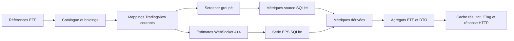

# Architecture courante de Metrics Overview

Ce document décrit le comportement réellement exécuté. Les correctifs restants
sont définis dans le [plan final dirigé](iterative-agent-work-plan.md) et les
preuves historiques utiles dans le [bilan d’ingénierie](engineering-review.md).

## Flux d’une requête



Responsabilités :

- `metrics-overview-service.ts` valide, orchestre et assemble le résultat ;
- `metrics-overview-screener.ts` gère candidats, résolution, couverture et
  persistance des fondamentaux ;
- `metrics-overview-estimates.ts` gère la série consensus, ses absences et sa
  persistance ;
- `metrics-overview-model.ts` construit les points graphiques et le DTO ETF.

## Holdings et identité

- Seuls les holdings actions de poids positif sont éligibles.
- Le provider iShares rejette un HTTP 200 qui ne contient pas de lignes de
  holdings plausibles.
- Pour les pages régionales concernées, le fallback officiel BlackRock
  product-data récupère `dateList`, puis le composant `holdings` daté.
- Un identifiant de secours sans ISIN inclut le ticker normalisé afin de ne pas
  fusionner des classes partageant le même nom.
- Le hash `ishares-holdings-v2:` force une relecture contrôlée des snapshots
  créés avant cette normalisation.

Un mapping TradingView courant exige :

- `provider = 'tradingview'` ;
- `status = 'resolved'` ;
- un `provider_symbol` non vide ;
- un symbole compatible avec les candidats actuels ;
- une provenance auditable : `exact_exchange`, `confirmed_alias`,
  `country_fallback` ou `cross_exchange`.

Une couverture numérique de 100 % ne suffit pas. L’audit contrôle aussi pays,
exchange, émetteur, alternatives, métadonnées et poids.

## Données Screener

Le Screener TradingView reçoit des symboles `EXCHANGE:TICKER` en lots. Les six
familles source utilisées sont notamment P/B, P/S, rendement, ROE,
dette/equity et bêta.

Un champ absent d’une réponse réussie :

1. n’écrit pas une ligne `NULL` qui masquerait une ancienne valeur numérique ;
2. crée une absence négative temporaire pour ce symbole et ce champ ;
3. masque la valeur concernée dans le résultat courant ;
4. produit une couverture `partial` explicite.

Un lot en échec ne crée aucune absence négative. Une valeur persistée compatible
peut être utilisée comme fallback `stale`.

## Série EPS Estimates

`security:eps_estimate_series:v1` contient exactement huit points valides :

- quatre estimations historiques associées aux derniers trimestres publiés ;
- quatre consensus trimestriels futurs.

Chaque point doit avoir une période unique, une estimation finie et un booléen
`IsReported` explicite. La série doit également fournir prix positif, devise et
symbole provider. Les EPS effectivement publiés ne participent à aucun calcul.

Une série mise en cache devient immédiatement incompatible si le mapping
TradingView change. Les métriques dérivées P/E et croissance sont alors retirées
jusqu’à réception d’une série valide pour la nouvelle identité.

## États de source

| État | Condition | Donnée affichée |
| --- | --- | --- |
| `live` | donnée fraîche reçue, aucune lacune | résultat frais |
| `cached` | aucun appel nécessaire, caches complets et compatibles | résultat persisté |
| `partial` | absence de symbole, champ ou série confirmée | valeur absente et couverture réduite |
| `stale` | erreur de transport ou holdings anciens | dernier fallback compatible, s’il existe |

Les warnings typés précisent holdings stale, mapping non résolu, Screener
partiel/indisponible et Estimates partiel/indisponible. `stale` a priorité sur
`partial` lorsqu’une même réponse combine absence confirmée et panne réelle.

## Agrégations actuelles

- P/E, P/B et P/S : moyenne harmonique pondérée sur les ratios positifs.
- Rendement, ROE, dette/equity et bêta : moyenne arithmétique pondérée.
- Croissance EPS estimée : croissance des earnings yields agrégés sur les
  composants ayant des P/E historique et forward positifs.

La formule exécutée est :

```text
Σ(poids / PE_forward) / Σ(poids / PE_historique) - 1
```

Les composants sans l’un des deux P/E positifs réduisent la couverture de cet
agrégat ; ils ne sont pas transformés en croissance nulle.

## Bubble chart et DTO

Le graphique constituants conserve :

- poids original du holding ;
- P/E historique et forward issus de la même série 4+4 ;
- croissance individuelle ;
- prix, devise et huit estimations compactes.

Le DTO courant conserve les champs de la réponse v1 publiée : identité
`securityId`/`providerSymbol`, sommes historique/forward et `estimatePoints`
complets. Les compteurs transparents (`eligibleHoldingCount`,
`missingMetricCount`, `excludedNonPositivePeCount` et `truncatedCount`) sont
ajoutés sans supprimer `eligibleCount` ni `excludedOutlierCount`.

Sont comptés séparément : séries/métriques manquantes, P/E forward non positif
et titres au-delà du top-500. Les axes incluent tous les points finis retenus ;
aucun clipping arbitraire d’outlier n’est appliqué.

La compaction précédente par `estimatePeriods`/`estimates` a été retirée du
contrat `/api/v1` : elle réduisait le payload mais supprimait des champs déjà
publiés. Le test `metrics-overview-model.test.ts` verrouille désormais les
champs v1 et les nouveaux compteurs.

## Persistance et caches

Tables principales :

- `holding_snapshots`, `holdings`, `securities` ;
- `security_provider_symbols` ;
- `metric_definitions`, `metric_observations` ;
- `provider_negative_cache`.

La table de cache négatif est indexée par provider, type, symbole et métrique,
avec une expiration epoch. Elle est prunée puis hydratée au premier bootstrap
du chemin SQLite courant. Seules les absences confirmées y sont écrites ; une
valeur revenue supprime sa clé.

Le cache résultat Metrics Overview est borné à huit sélections. Les données
`partial` peuvent être réutilisées brièvement car leurs absences sont déjà
explicites ; les données `stale` ne doivent pas être rendues durables par le
cache HTTP.

La réponse HTTP sérialise une seule fois `{ data: result }`. Son ETag est le
hash de cette chaîne exacte : toute différence de champ, compteur, ordre ou
warning invalide le validateur et produit une nouvelle réponse `200`.

Le runtime cible reste Next.js standalone, SQLite durable hors `.next` et une
seule instance applicative. Un cache distribué est hors périmètre.

## Migrations et lectures chaudes

- `0006` ajoute l’index de lecture des observations récentes ;
- `0007` et `0008` retirent les séries EPS dérivées invalides ;
- `0009` retire les anciennes définitions métriques ;
- `0010` ajoute le cache négatif persistant.

Les lectures chaudes des métriques numériques et des séries EPS utilisent du
SQL paramétré direct, avec reconstruction et validation en TypeScript. Les
autres accès restent sous Drizzle. Cette exception est limitée aux deux chemins
dont le gain a été mesuré.

## Validation et limites

Les diagnostics sont activés uniquement avec `METRICS_DIAGNOSTICS=1`. Ils
émettent timings et compteurs dans les logs, jamais dans le DTO.

Le dernier audit strict de la base compte 3 571 mappings résolus, aucune
provenance manquante et aucun mismatch entre mapping, Screener et Estimates.
Cette couverture d’identité ne signifie pas que tous les champs fondamentaux
sont disponibles : la couverture par métrique reste affichée séparément.

La validation finale du 2026-08-03 passe avec `npm test` et `npm run build`, y
compris les processus enfants `tsx`, le worker TypeScript et la génération des
12 pages Next. Le précédent `spawn EPERM` était donc une restriction de la
sandbox, pas une défaillance du projet.
